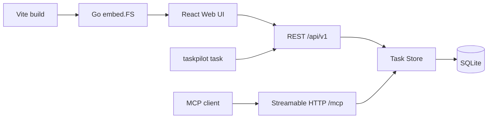

# 架构说明

## 运行模型

`taskpilot serve` 是唯一会直接访问 SQLite 的进程。它监听 `127.0.0.1:8080`，提供静态 Web 文件、REST API 和 MCP endpoint。CLI 不直接打开数据库，而是调用正在运行的 REST 服务；这样 Web、CLI 和 MCP 都经过同一套任务规则、事务与版本检查。

服务层位于 `internal/app/`：

| 文件 | 职责 |
| --- | --- |
| `app.go` | SQLite 初始化、任务/标签读写、事务、REST 路由、本地访问限制与内嵌静态资源。 |
| `mcp.go` | 官方 Go MCP SDK 的无状态 Streamable HTTP 服务与十个工具定义。 |
| `app_test.go` | 任务规则、REST 与 MCP SDK 端到端回归测试。 |

`web/src/` 包含 React 入口、API 客户端、类型和样式。`npm run build` 将产物写入 `internal/app/static/`；Go 使用 `embed.FS` 将其编译进最终二进制。

## 数据与一致性

- `tasks` 使用 UUID 主键与单调递增的 `TASK-数字` 展示编号。
- `tags` 通过 `COLLATE NOCASE` 去重；`task_tags`、`subtasks`、`task_relations` 为子表。
- 任务、标签、子任务和关联关系在一个 SQLite 事务内写入。
- `task_relations` 保存规范化后的 UUID 对，因此查询时可以得到双向关联。
- `version` 每次任务更新递增；REST/MCP 的调用方可据此发现并发编辑冲突。
- `schema_migrations` 记录数据库 schema 版本。启动会初始化缺失表与元数据，现有数据库不会被重置。

## 本地安全边界

服务仅设计为本机使用。REST 外层检查 Host，只接受 `localhost` 和 `127.0.0.1`；MCP transport 还使用 Go 标准库跨源保护和 SDK 的 localhost DNS-rebinding 防护。不要使用反向代理或端口转发将 TaskPilot 暴露到公网。

## 发布

发布脚本先构建嵌入式 Web 资源并运行 Go 测试，再交叉编译 macOS arm64、macOS amd64 和 Windows amd64 可执行文件。SQLite 使用纯 Go 驱动，因此目标系统不需要安装 C 编译器或 SQLite 动态库。
